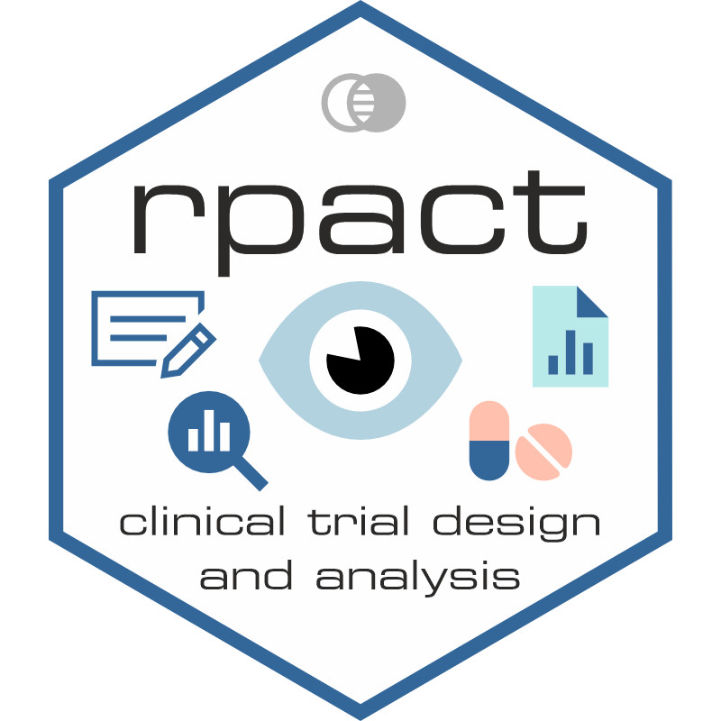

---
output:
  md_document:
    variant: gfm
---

```{r, echo = FALSE}
knitr::opts_chunk$set(
  collapse = TRUE,
  comment = "#>",
  fig.path = "man/figures/README-",
  out.width = "100%"
)
```

 <!-- badges: start -->
[](https://cran.r-project.org/package=rpact) 
[](https://github.com/rpact-com/rpact/actions/workflows/R-CMD-check.yaml) 
[](https://CRAN.R-project.org/package=rpact) 
[](https://CRAN.R-project.org/package=rpact) 
[](https://lifecycle.r-lib.org/articles/stages.html#stable) 
[](https://cran.r-project.org/web/licenses/LGPL-3) 
[](https://app.codecov.io/gh/rpact-com/rpact?branch=main)
[](https://doi.org/10.1007/978-3-031-89669-9) 
[](https://rpact-cloud.share.connect.posit.cloud)
[](https://rpact-connect.share.connect.posit.cloud)
 <!-- badges: end -->

# rpact <a href="https://www.rpact.com"></a>

`rpact` is an R package for planning, simulating, and analyzing confirmatory
clinical trials. It supports common tasks such as sample size and power
calculations for standard fixed-sample trials, as well as classical group
sequential designs with interim analyses. Methods are available for continuous,
binary, survival, and count data endpoints.

For innovative trial designs, `rpact` provides simulation-based evaluation of
power and other operating characteristics, multi-stage adaptive hypothesis tests
based on the combination testing principle, adaptive sample size or event-number
reassessment, multi-arm multi-stage (MAMS) designs, and population enrichment
designs. This allows users to start with routine trial planning and use the same
package for more advanced adaptive methods when needed.

## What rpact can do

`rpact` covers the main steps of confirmatory trial planning, simulation, and
analysis:

### Sample size and power planning

* Standard fixed-sample designs without interim analyses
* Classical group sequential designs with planned interim analyses
* Sample size and power calculations for
    + means (continuous endpoints)
    + rates (binary endpoints)
    + survival endpoints with flexible recruitment and survival-time options
    + count data endpoints

### Simulation and adaptive trial design

* Power and operating-characteristic simulations for means, rates, survival
  data, and count data
* Assessment of adaptive sample size or event-number reassessment based on
  conditional power
* Multi-stage adaptive hypothesis testing based on the combination testing
  principle
* Assessment of treatment selection strategies in multi-arm trials, including
  multi-arm multi-stage (MAMS) settings
* Simulation and analysis methods for population enrichment designs with means,
  rates, and hazard ratios

### Analysis and trial conduct

* Confirmatory analysis for means, rates, and survival endpoints in one-arm,
  two-arm, and multi-arm trials
* Support for fixed-sample designs, classical group sequential designs, and
  adaptive multi-arm multi-stage (MAMS) designs based on the inverse normal or
  Fisher combination test
* Automatic boundary recalculation during a trial using alpha-spending
  approaches, including under- and over-running

## Installation

Install the latest stable release from CRAN:

```{r installation_cran, eval=FALSE, include=TRUE, echo=TRUE, results='hide'}
install.packages("rpact")
```

### Development version

To try features that are not yet available in the CRAN release, install the
development version of `rpact` from
[GitHub](https://github.com/rpact-com/rpact):

```{r installation_github, eval=FALSE, include=TRUE, echo=TRUE, results='hide'}
# install.packages("pak")
pak::pak("rpact-com/rpact")
```

## Documentation

The complete package documentation is available at
[www.rpact.org](https://www.rpact.org).

## Vignettes

Step-by-step examples and tutorials are available in the `rpact` vignettes at
[www.rpact.org/vignettes](https://www.rpact.org/vignettes/).

## Issues and Feature Requests

If you find a bug or would like to suggest an improvement, please use the
`rpact` GitHub issue tracker.

* 🐞 [Report a
  bug](https://github.com/rpact-com/rpact/issues/new?template=bug_report.yml)  
  Please include a minimal reproducible R example, or a runnable R Markdown
  (`.Rmd`) or Quarto (`.qmd`) document.

* ✨ [Request a
  feature](https://github.com/rpact-com/rpact/issues/new?template=feature_request.yml)  
  Please describe the use case, affected function(s), and the expected benefit.

Before opening a new issue, please [search existing
issues](https://github.com/rpact-com/rpact/issues) to avoid duplicates.

Because GitHub issues are public, please do not include confidential,
customer-specific, personal, regulated, or security-sensitive information.

## RPACT Cloud

**RPACT Cloud** is a web-based graphical user interface for `rpact`. It provides
guided, browser-based access to selected `rpact` functionality, including study
design, sample size calculation, simulation, and reporting, without requiring
users to write R code.

[rpact.cloud](https://demo.rpact.cloud)

## RPACT Connect

**RPACT Connect** provides access to insights, downloads, and premium support
for users and organizations working with RPACT software.

[connect.rpact.com](https://connect.rpact.app)

## The RPACT User Group

The **RPACT User Group** brings together users and decision-makers from the
pharmaceutical industry and CROs. Members meet regularly to exchange experience,
discuss best practices, and provide input that helps shape the open-source
development of `rpact`.

We invite interested users and organizations to join the community, share
know-how, and contribute to the future development of statistical tools for
clinical trials.

## Use in regulated corporate environments

For organizations using `rpact` in FDA/GxP-regulated environments, RPACT offers
support and formal validation documentation for use on validated corporate
computer systems. The documentation can be customized and licensed for exclusive
use by your company to support applicable regulatory requirements.

The validation documentation also contains the personal access data required to
perform the installation qualification with `testPackage()`.

> [Contact RPACT](https://www.rpact.com/contact/) to learn more.

## About

- **rpact** is a comprehensive R package for clinical trial planning, design,
  simulation, and analysis.

  It supports standard fixed-sample and classical group sequential designs,
  sample size and power calculations, simulation-based evaluation of operating
  characteristics, multi-stage adaptive designs, multi-arm and enrichment
  methods, and confirmatory trial analysis.

  `rpact` is free of charge and open source, licensed under
  [LGPL-3](https://cran.r-project.org/web/licenses/LGPL-3). It implements a
  broad range of methods described in the monograph by [Wassmer and Brannath
  (2025)](https://doi.org/10.1007%2F978-3-031-89669-9).

  Formal validation documentation is available to customers and supporting
  members. For more information, visit
  [www.rpact.com/services/sla](https://www.rpact.com/services/service-level-agreement/).

> For package documentation, examples, and vignettes, visit
> [www.rpact.org](https://www.rpact.org).

- **RPACT** develops **Statistical Tools for Drug Development**.

  We build and support open-source and commercial software solutions for
  clinical research, including R packages, Shiny applications, validated
  workflows, and cloud-based tools for trial planning, simulation, dose finding,
  analysis, and reporting.

  RPACT is the team behind tools such as
  [rpact](https://cran.r-project.org/package=rpact),
  [crmPack](https://cran.r-project.org/package=crmPack), and [RPACT
  Cloud](https://rpact-cloud.share.connect.posit.cloud).

> For more information, visit [www.rpact.com](https://www.rpact.com).
